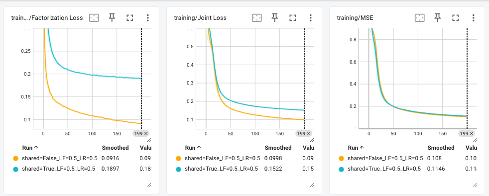

### 1. Compare all 4 settings (share or not * different loss weights)
* MSE increases through epochs during training but decreases during evaluation, indicating _**the regression model is overfit**_. Weighting more on MF model and totally sharing parameters can mitigate this problem, presented by the black line, grows much less than other three settings. Other solutions: implementing regularization techniques, simplifying the model, increasing training data, and using early stopping

### 2. Compare shared embeddings with different loss weights
* When totally share embeddings(parameters), half-half weighted loss damages the training on the first task: using matrix factorization to predict the probability p that a user would watch the movie.

### 3. Compare seperate embeddings with different loss weights
* If not share parameters at all, both weight settings meet overfit problem in regression model, while the performance on probability predicting task seems quite similar. 

* Weighting more on LF loss can reduce the joint loss during training process

### 4. Compare shared and seperate embeddings with loss weights = [0.5, 0.5]
* Sharing parameters can worsen the performance on probability prediction task (matrix factorization), while not affecting much on regression task.

* Sharing paramters increases loss on factorization task on joint loss.

### 5. Compare shared and seperate embeddings with loss weights = [0.99, 0.01]
* Increasingly weighting 99% on LF can improve factorization performance on validation set while sharing parameters

* Increasingly weighting 99% on LF negatively affect the training of regression task when sharing parameters.

